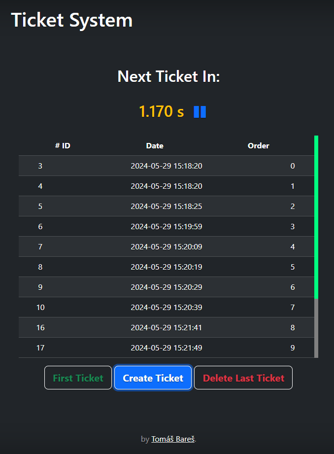

# Ticket System Doc

### Structure
- Ticket system je tvoren z kontroleru TicketControler a dvou service implementujicich TicketService
    - [TicketController](src/main/java/cz/ticketsystem/controller/TicketController.java) obsahuje 5 endpointu
      - /all - získá všechny Tickety a navrati je jako List
      - /create - vytvori novy ticket a ulozi ho do pameti
      - /first - navrati hodnotu prvniho ticketu v pameti
      - /deleteFirst - navrati a smaze prvni ticket
      - /deleteLast - navrati a smaze posledni ticket
    - [TicketQueueService](src/main/java/cz/ticketsystem/service/TicketQueueService.java)
      - postevena na PriorityQueue
      - v prubehu implementace jsem si uvedomil, ze nemohu snadno ziskat vsechny prvky aniz bych je musel z PriorityQueue odstranit
      - nahrazena TicketListService
    - [TicketListService](src/main/java/cz/ticketsystem/service/TicketListService.java)
      - postavena na LinkedListu, ktery umi vsechny potrebne operace ze zadani
      - pro efektivitu neni ukladano poradi do pameti, ale vytvoreno pri pozadavku
    - [Ticket](src/main/java/cz/ticketsystem/model/Ticket.java)
      - modelovy objekt
      - udrzuje id a creationDateTime
      - lze z nej vytvorit TicketWithOrder
    - [TicketWithOrder](src/main/java/cz/ticketsystem/model/TicketWithOrder.java)
      - potomek Ticket
      - udrzuje navic order
    - [TicketSystemApplicationTests](src/test/java/cz/ticketsystem/TicketSystemApplicationTests.java)
      - obsahuje par jednoduchych testu pro TicketService
      - TicketService je zvolena podle anotace @Primary v jedne z implementaci
- Projekt take obsahuje jednoduche webove rozhrani
  - rozhrani je pristupne z [localhost:8080](http://localhost:8080/) v defaultni konfiguraci
  - pri implementace teto casti, uz nebyl kladen takovy duraz na detail, jelikoz se tato cast netykala zadani

### Time required
- Celý projekt mi trvalo sestavit cca 5h
  - Struktura a hlavni logika REST API mi zabrala 1.5h
    - Zdrzel jsem se na nevhodne implementaci pomoci PriorityQueue
    - Cas take trochu protahla nejasnost zadani, kdy jsem si nebyl jisty, zda ziskani prvniho prvku ve fronte nema prvek i odstranit.
  - Implementace testu zabrala cca 30 min
  - Zbytek case jsem stravil vytvorenim html sablony spolecne s JS logikou pro ziskavani dat z API
    - [index.html](src/main/resources/static/index.html) je tvoren na [Bootstrapu 5.3](https://getbootstrap.com/docs/5.3/) za pouziti sablony [Cover](https://getbootstrap.com/docs/5.3/examples/cover/)
      - vyuzita ikona z [FontAwesome](https://fontawesome.com/)
    - [main.js](src/main/resources/static/main.js) (potrebuje jeste nekolik uprav aby se dal povazovat za clean-code)
      - psano ve vanilla JS

### Možná rozšíření
- Namísto použití neperzistentní paměti se lístky ukládají do databáze (pro tento typ úlohy např. mybatis).

### Webová stránka klientské aplikace
